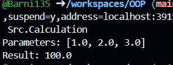
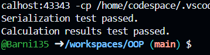
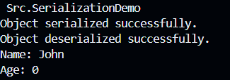
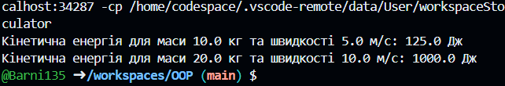

Завдання 1

```package Src;

import java.util.Arrays;

/**
 * Клас, що представляє об'єкт для зберігання параметрів і результатів обчислень.
 */
public class Calculation {
    private double[] parameters;
    private double result;

    /**
     * Конструктор класу CalculationData.
     * @param parameters масив параметрів
     * @param result результат обчислення
     */
    public Calculation(double[] parameters, double result) {
        this.parameters = parameters;
        this.result = result;
    }

    /**
     * Отримати параметри.
     * @return масив параметрів
     */
    public double[] getParameters() {
        return parameters;
    }

    /**
     * Отримати результат обчислення.
     * @return результат обчислення
     */
    public double getResult() {
        return result;
    }

    /**
     * Головний метод, в якому ви можете тестувати клас CalculationData.
     * @param args аргументи командного рядка (не використовуються в цьому прикладі)
     */
    public static void main(String[] args) {
        // Приклад використання класу CalculationData
        double[] parameters = {1.0, 2.0, 3.0};
        double result = 100.0;

        // Створення об'єкту CalculationData
        Calculation data = new Calculation(parameters, result);

        // Виведення параметрів та результату обчислення
        System.out.println("Parameters: " + Arrays.toString(data.getParameters()));
        System.out.println("Result: " + data.getResult());
    }
}
```


Завдання 2

CalculationData

```package Src;

import java.io.Serializable;

/**
 * Клас, що представляє об'єкт для зберігання параметрів і результатів обчислень.
 */
class CalculationData implements Serializable {
    private double[] parameters;
    private double result;

    /**
     * Конструктор класу CalculationData.
     * @param parameters масив параметрів
     * @param result результат обчислення
     */
    public CalculationData(double[] parameters, double result) {
        this.parameters = parameters;
        this.result = result;
    }

    /**
     * Отримати параметри.
     * @return масив параметрів
     */
    public double[] getParameters() {
        return parameters;
    }

    /**
     * Отримати результат обчислення.
     * @return результат обчислення
     */
    public double getResult() {
        return result;
    }
}
```
Tester

```package Src;

import java.io.ByteArrayInputStream;
import java.io.ByteArrayOutputStream;
import java.io.IOException;
import java.io.ObjectInputStream;
import java.io.ObjectOutputStream;
import java.util.Arrays;

/**
 * Клас для тестування коректності результатів обчислень та серіалізації/десеріалізації.
 */
public class Tester {
    public static void main(String[] args) {
        // Приклад для тестування
        double[] parameters = {1.5, 2.5, 3.5};
        double result = 14.5;
        CalculationData data = new CalculationData(parameters, result);

        // Тестування серіалізації та десеріалізації
        boolean serializationTestResult = testSerialization(data);
        if (serializationTestResult) {
            System.out.println("Serialization test passed.");
        } else {
            System.out.println("Serialization test failed.");
        }

        // Приклад тестування результатів обчислень
        double expectedResult = 14.500001; // Невелике відхилення для тестування
        boolean calculationTestResult = testCalculationResults(result, expectedResult);
        if (calculationTestResult) {
            System.out.println("Calculation results test passed.");
        } else {
            System.out.println("Calculation results test failed.");
        }
    }

    /**
     * Метод для тестування серіалізації та десеріалізації.
     * @param data об'єкт, який буде серіалізований та відновлений
     * @return true, якщо тест пройшов успішно, false - в іншому випадку
     */
    public static boolean testSerialization(CalculationData data) {
    try {
        // Серіалізація
        ByteArrayOutputStream outputStream = new ByteArrayOutputStream();
        ObjectOutputStream objectOutputStream = new ObjectOutputStream(outputStream);
        objectOutputStream.writeObject(data);
        objectOutputStream.close();

        // Десеріалізація
        ByteArrayInputStream inputStream = new ByteArrayInputStream(outputStream.toByteArray());
        ObjectInputStream objectInputStream = new ObjectInputStream(inputStream);
        CalculationData restoredData = (CalculationData) objectInputStream.readObject();
        objectInputStream.close();

        // Порівняння параметрів та результату
        return Arrays.equals(data.getParameters(), restoredData.getParameters()) &&
               Double.compare(data.getResult(), restoredData.getResult()) == 0;
    } catch (IOException | ClassNotFoundException e) {
        e.printStackTrace();
        return false;
    }
}
    /**
     * Метод для тестування результатів обчислень.
     * @param result1 перший результат
     * @param result2 другий результат
     * @return true, якщо результати приблизно однакові, false - в іншому випадку
     */
    public static boolean testCalculationResults(double result1, double result2) {
        double epsilon = 0.00001; // Епсилон для порівняння результатів
        return Math.abs(result1 - result2) < epsilon;
    }
}
```



Завдання 3

```package Src;

import java.io.*;

/**
 * Клас для демонстрації серіалізації та десеріалізації об'єктів.
 */
class DemoObject implements Serializable {
    private String name;
    private transient int age; // Поля зі словом transient не серіалізуються

    /**
     * Конструктор класу DemoObject.
     * @param name ім'я об'єкта
     * @param age вік об'єкта
     */
    public DemoObject(String name, int age) {
        this.name = name;
        this.age = age;
    }

    /**
     * Метод для отримання імені об'єкта.
     * @return ім'я об'єкта
     */
    public String getName() {
        return name;
    }

    /**
     * Метод для отримання віку об'єкта.
     * @return вік об'єкта
     */
    public int getAge() {
        return age;
    }

    /**
     * Метод для відображення стану об'єкта.
     */
    public void displayState() {
        System.out.println("Name: " + name);
        System.out.println("Age: " + age);
    }
}

/**
 * Клас для демонстрації серіалізації та десеріалізації об'єктів.
 */
public class SerializationDemo {
    /**
     * Точка входу в програму.
     * @param args аргументи командного рядка (не використовуються в цьому випадку)
     */
    public static void main(String[] args) {
        // Створення об'єкта для серіалізації
        DemoObject obj = new DemoObject("John", 30);

        // Шлях до файлу для збереження серіалізованого об'єкта
        String fileName = "demoObject.ser";

        // Серіалізація об'єкта
        try (ObjectOutputStream outputStream = new ObjectOutputStream(new FileOutputStream(fileName))) {
            outputStream.writeObject(obj);
            System.out.println("Object serialized successfully.");
        } catch (IOException e) {
            e.printStackTrace();
        }

        // Відновлення стану об'єкта після серіалізації
        try (ObjectInputStream inputStream = new ObjectInputStream(new FileInputStream(fileName))) {
            DemoObject restoredObj = (DemoObject) inputStream.readObject();
            System.out.println("Object deserialized successfully.");
            restoredObj.displayState(); // Виведення відновленого стану об'єкта
        } catch (IOException | ClassNotFoundException e) {
            e.printStackTrace();
        }
    }
}
```



Індувідуальне завдання 1
```package Src;

/**
 * Клас для обчислення кінетичної енергії фізичного тіла.
 */
public class KineticEnergyCalculator {

    /**
     * Метод для обчислення кінетичної енергії фізичного тіла.
     * 
     * @param mass     маса фізичного тіла (в кг)
     * @param velocity швидкість фізичного тіла (в м/с)
     * @return значення кінетичної енергії (в джоулях)
     */
    public static double calculateKineticEnergy(double mass, double velocity) {
        return 0.5 * mass * velocity * velocity;
    }

    /**
     * Метод main, який є точкою входу у програму.
     * 
     * @param args аргументи командного рядка (не використовуються в цьому випадку)
     */
    public static void main(String[] args) {
        // Приклади обчислення кінетичної енергії для різних значень маси та швидкості
        double mass1 = 10; // маса 10 кг
        double velocity1 = 5; // швидкість 5 м/с
        double kineticEnergy1 = calculateKineticEnergy(mass1, velocity1);
        System.out.println("Кінетична енергія для маси " + mass1 + " кг та швидкості " + velocity1 + " м/с: " + kineticEnergy1 + " Дж");

        double mass2 = 20; // маса 20 кг
        double velocity2 = 10; // швидкість 10 м/с
        double kineticEnergy2 = calculateKineticEnergy(mass2, velocity2);
        System.out.println("Кінетична енергія для маси " + mass2 + " кг та швидкості " + velocity2 + " м/с: " + kineticEnergy2 + " Дж");
    }
}
```
